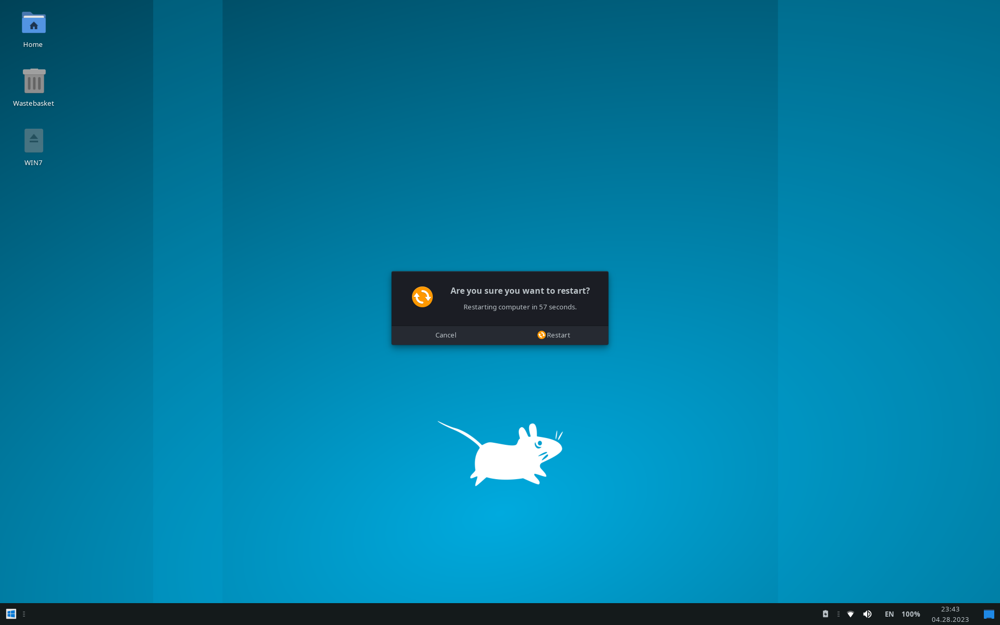

# XFCE custom presets

1. [Windows XFCE](#windows-xfce)
2. [Mac XFCE](#mac-xfce)
3. [Default XFCE](#default-xfce)
4. [Stylesheets presets](#stylesheets-presets)
5. [Console color palette and geometry](#console-color-palette-and-geometry)
6. [Keyboard shortcuts](#keyboard-shortcuts)
7. [Application menu](#application-menu)

---

# Terminal view


---

## Windows XFCE
> professional


**Explorer**


**Start menu**


**Search program**


**Workspace**


**Exit menu**



**Terminal**


**Console Task Manager**


**Start Office**


**Office Document**


**FreeCAD**


**FreeCAD Project**


**Multimedia**


**Charging**


**About**


**XFCE Desktop**


---

## Mac XFCE
> industrial


**Console**


**Explorer**


**Menu**


**Directory menu**


**Exit menu**


**Application Finder**


**Launch FreeCAD**


**FreeCAD night UI**


**FreeCAD Project**


**KiCad**


**KiCad Design**


**Office**


**Office full screen**


**Window switcher**


**About**


**Multimedia**


---

## Default XFCE


---

## Stylesheets presets

```
touch ~/.config/gtk-3.0/gtk.css
```

Remove XFCE specific dotted UI artifacts:

```
echo "/* Remove dotted lines from GTK 3 applications */
undershoot.top, undershoot.right, undershoot.bottom, undershoot.left {
	background-image: none;
}" >> ~/.config/gtk-3.0/gtk.css
```

Add indentations to console:

```
echo "/* Console stylesheets */
VteTerminal, vte-terminal {
	padding: 7px;
}" >> ~/.config/gtk-3.0/gtk.css
```

## Console color palette and geometry

```
echo "export PS1='\[\033[01;32m\]➞\[\033[00m\] '" >> ~/.bashrc
```

- [x] Source Code Pro Regular, 14px
- [x] 1.05 line spacing
- [x] 66 width
- [x] 20 height

```
- Body colors
  background: "#141A1B"
  foreground: "#B3B1AD"

- Normal colors
  black: "#01060E"
  red: "#EA6C73"
  green: "#00AA00"
  yellow: "#F9AF4F"
  blue: "#53BDFA"
  magenta: "#FF79C6"
  cyan: "#90E1C6"
  white: "#C7C7C7"

- Bright colors
  black: "#686868"
  red: "#F07178"
  green: "#C2D94C"
  yellow: "#FFB454"
  blue: "#59C2FF"
  magenta: "#FF92DF"
  cyan: "#95E6CB"
  white: "#FFFFFF"
```

## Keyboard shortcuts

Show desktop: `Ctrl` + `Alt` + `d`
Resize window: `Alt` + `Right click` + `Move`

## Application menu

To edit menu layout:

```
mkdir ~/.config/menus
cd ~/.config/menus
cp /etc/xdg/menus/xfce-applications.menu .
ls -a
```