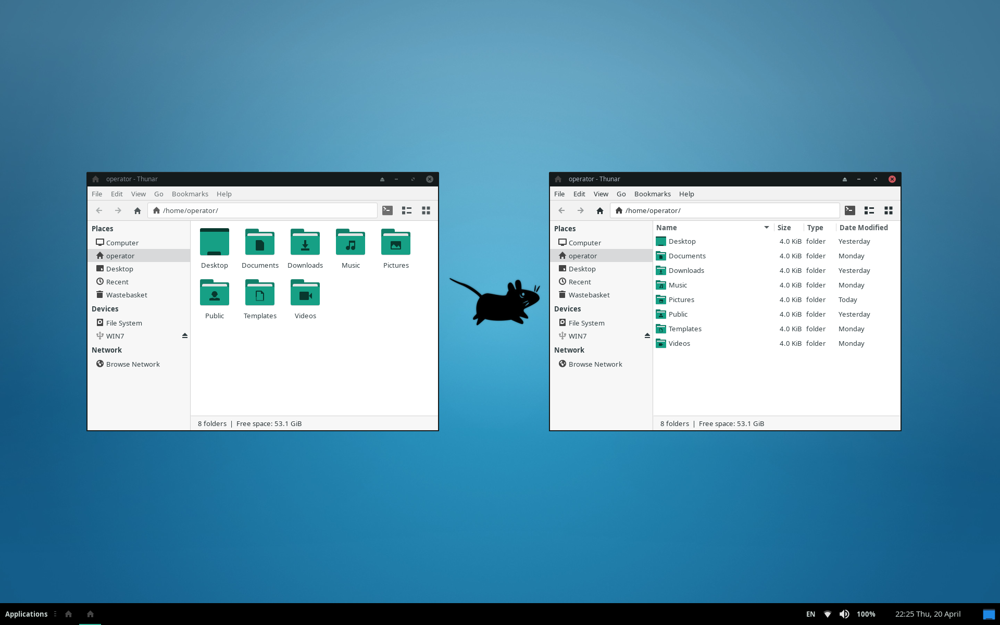
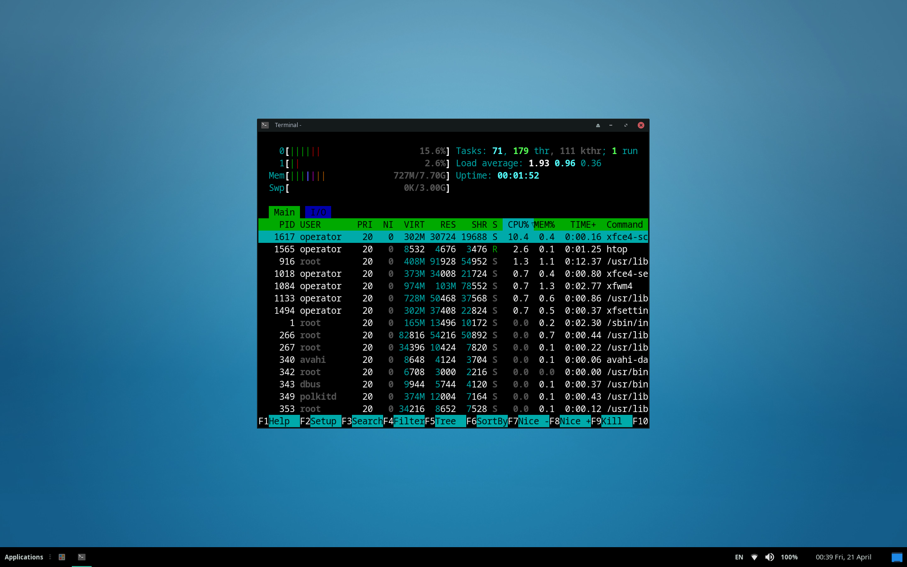
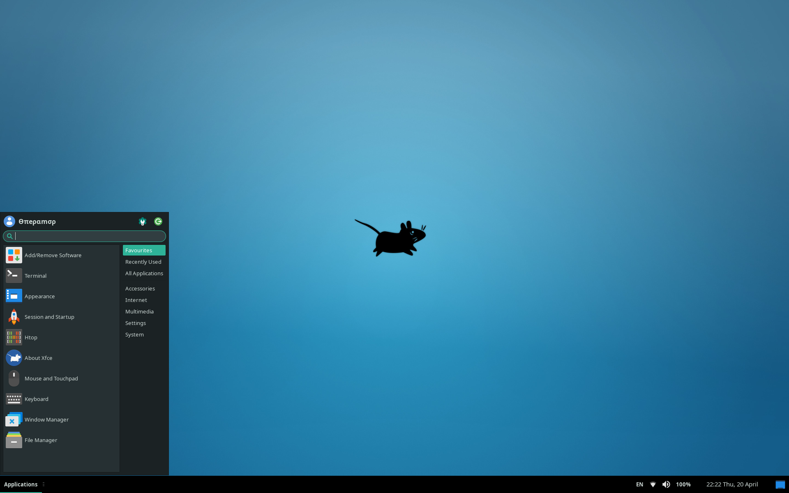
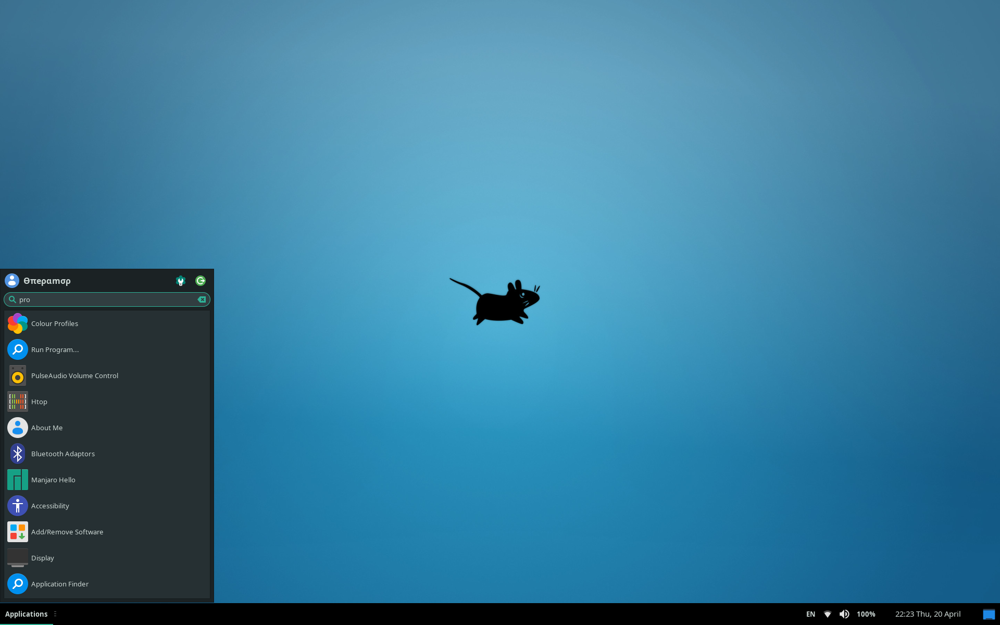
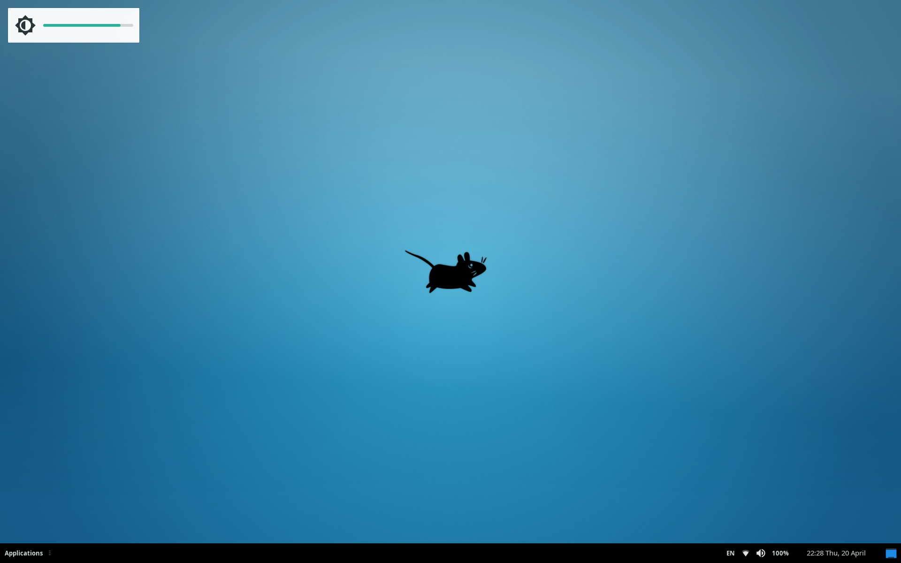
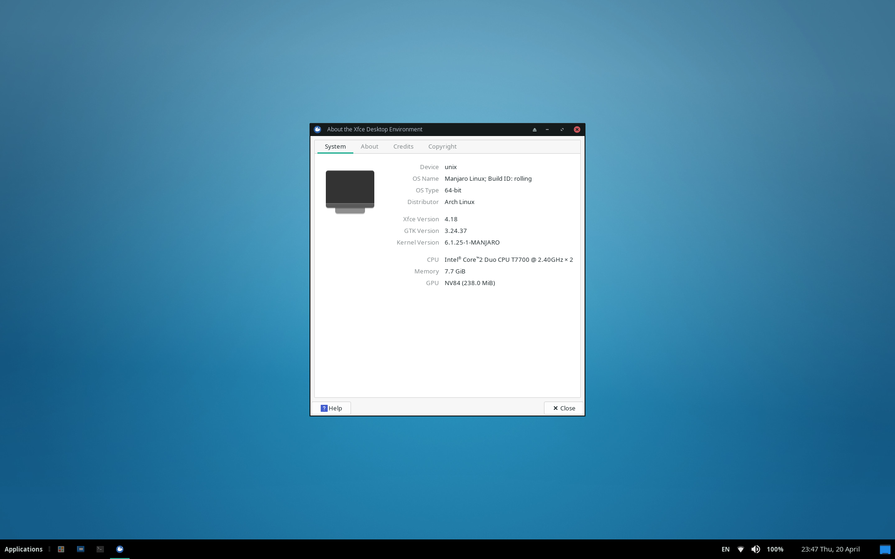
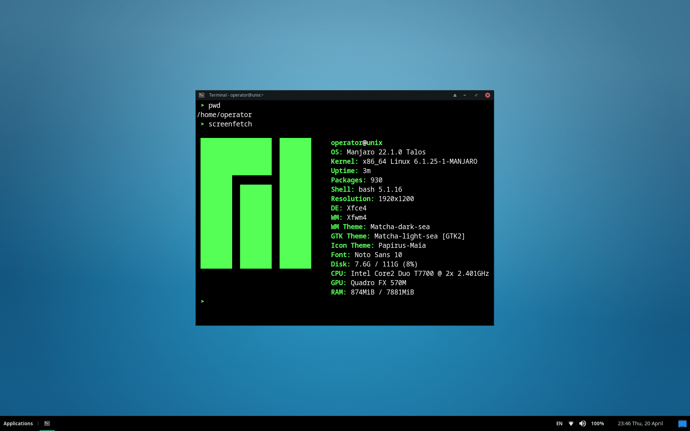
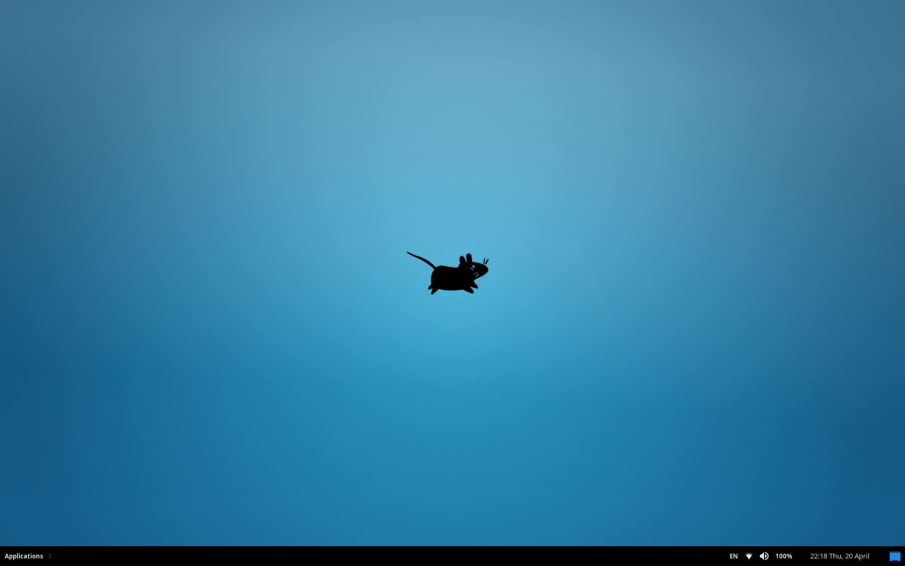

# XFCE desktop environment personal settings

1. [Industrial XFCE](#industrial-xfce)
2. [Dark XFCE](#dark-xfce)
3. [Default XFCE](#default-xfce)

---

## Industrial XFCE

---

## Dark XFCE

---

## Default XFCE

