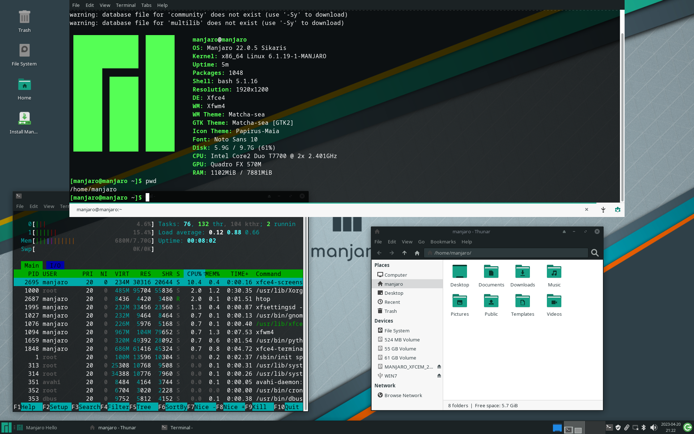

# XFCE desktop environment personal settings

1. [Industrial XFCE](#industrial-xfce)
2. [Night XFCE](#night-xfce)
3. [Default XFCE](#default-xfce)

---

# Terminal view

---

## Industrial XFCE

---

## Night XFCE

---

## Default XFCE

