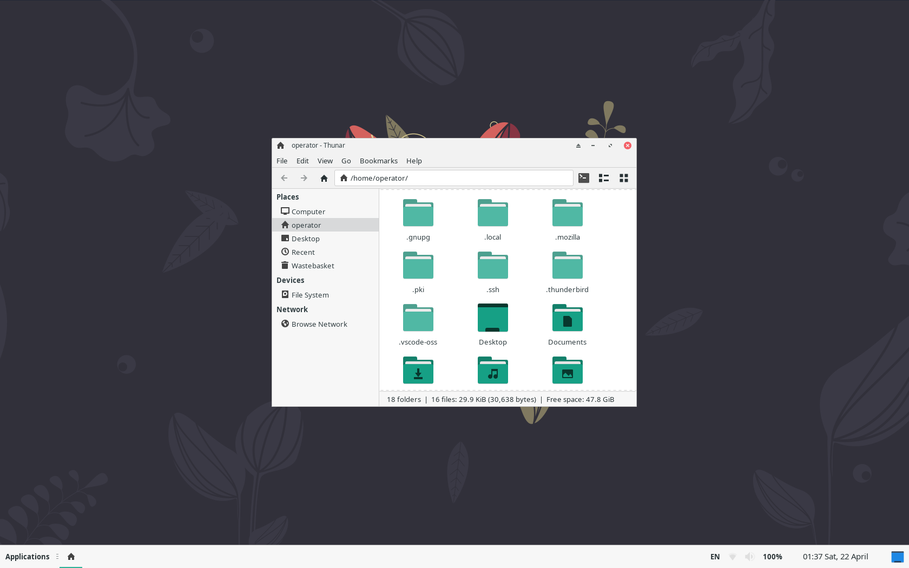

# UNIX-like work environment


- Download OS: https://manjaro.org/
	- linux: Manjaro XFCE
	- kernel: 6.1
	- iso: minimal
	- image: `manjaro-xfce-22.0.5-minimal-230316-linux61.iso`
- Create a bootable USB
- Install:
	- swap (memory: [Do I Need Swap](https://wiki.manjaro.org/index.php/Swap))
	- boot (500 MiB)
	- /
	- home

---

## Table of Contents
1. [Updating, system processing, cleaning](#updating-system-processing-cleaning)
	- [Burn an ISO image](#burn-an-iso-image)
2. [Package management](#package-management)
	- [Installation via GUI](#installation-via-gui)
	- [Installation via console](#installation-via-console)
	- [Build from source](#build-from-source)
3. [Preliminary steps](#preliminary-steps)
4. [Software installation](#software-installation)
	- [Web surfing and chatting](#web-surfing-and-chatting)
		- [Telegram](#telegran)
		- [Firefox](#firefox)
		- [Brave browser](#brave-browser)
        - [Mail client](#mail-client)
	- [Office environment](#office-environment)
		- [Document editor](#document-editor)
		- [PDF viewer](#pdf-viewer)
		- [E-book reader](#e-book-reader)
		- [Calculator](#calculator)
	- [Multimedia](#multimedia)
		- [Audio player](#audio-player)
		- [Movie player](#movie-player)
		- [Illustration viewer](#illustration-viewer)
		- [Graphics editor](#graphics-editor)
5. [Package managers tooling](#package-managers-tooling)
	- [pamac](#pamac)
	- [yay](#yay)
	- [snapd](#snapd)
6. [Fonts](#fonts)
	- [IBM Plex Fonts](#ibm-plex-fonts)
	- [Microsoft Windows Fonts](#microsoft-windows-fonts)
	- [Mono Fonts by JetBrains](#mono-fonts-by-jetbrains)
	- [Fonts for LaTeX](#fonts-for-latex)
7. [Console environment](#console-environment)
	- [Neovim](#neovim)
	- [Tmux](#tmux)
	- [Bat](#bat)
	- [Alacritty](#alacritty)
	- [Midnight commander](#midnight-commander)
8. [SSH](#ssh)
9. [Programming](#programming)
	- [Rust](#rust)
	- [Deno](#deno)
	- [Node.js](#node.js)
	- [PHP](#php)
	- [Python](#python)
		- [Compiling from binaries](#compiling-from-binaries)
		- [Setup env](#setup-env)
		- [Install using pyenv](#install-using-pyenv)
	- [Haskell](#haskell)
	- [Kotlin](#kotlin)
	- [Go](#go)
	- [Docker](#docker)
	- [PostgreSQL](#postgresql)
		- [DB setup](#db-setup)
		- [Installation pgAdmin](#installation-pgadmin)
10. [Code editors](#code-editors)
	- [VSCodium](#vscodium)
		- [Extensions set](#extensions-set)
		- [User settings](#user-settings)
	- [IntelliJ IDEA](#intellij-idea)
	- [PyCharm](#pycharm)
	- [Code::Blocks](#codeblocks)
11. [Engineering](#engineering)
	- [LaTeX](#latex)
		- [TexStudio](#texstudio)
		- [VSCode as Tex-editor](#vscode-as-tex-editor)
	- [FreeCAD](#freecad)
	- [KiCad](#kicad)
	- [Scilab](#scilab)
	- [CircuitJS](#circuitjs)
	- [Micropython](#micropython)
	- [Octave](#octave)
	- [Drawio](#drawio)
	- [Inkscape](#inkscape)
	- [VirtualBox](#virtualbox)
12. [Desktoping](#desktoping)
	- [Movie editor](#movie-editor)
	- [Desktop streaming](#desktop-streaming)
	- [Key streaming](#key-streaming)
	- [Guitar tuner](#guitar-tuner)
	- [Screenshot utility](#screenshot-utility)
	- [Tex Match](#tex-match)
	- [Offline dictionaries](#offline-dictionaries)
		- [StarDict](#stardict)
		- [GoldenDict](#goldendict)
	- [FreeTube](#freetube)
13. [Hardware](#hardware)
14. [Run OS in terminal mode](#run-os-in-terminal-mode)
15. [Setup graphics](#setup-graphics)
	- [Automated identification and installation](#automated-identification-and-installation)
	- [Manual identification and installation](#manual-identification-and-installation)
	- [Dual GPU](#dual-gpu)

---

# Updating, system processing, cleaning

To disable system updates: 
- `Applications` >> `Settings` >> `Add/Remove Software` >> `Preferences` 
- turn off **Check for updates**

## System processing

To run something via console call it `Ctrl + Alt + T` and try to enter this:

```
sudo pacman -S xfce4-notes-plugin
```

```
xfce4-notes
```

Use `htop` in terminal or `kill PID` to manage running processes:


## Cleaning

List packages:

```
ls /var/cache/pacman/pkg/ | less
```

Remove all pkg except those installed:

```
sudo pacman -Sc
``` 

Remove all files from pkg cache:

```
sudo pacman -Scc
```

## Burn an ISO image

List of mounted partitions:

```
sudo fdisk -l
```

Type the command to write the OS image, where `/sdc` is the target flash drive:

```
sudo dd bs=4M if=/home/operator/Downloads/manjaro.iso of=/dev/sdc status=progress oflag=sync
```

---

# Package management

## Installation via GUI

Use `Add/Remove Software` to install the package you are looking for.

## Installation via console

Installing packet:

```
sudo pacman -S <packet>
```

Removing:

```
sudo pacman -R <packet>
```

Find:

```
sudo pacman -Ss <packet>
sudo pacman -Rs <packet>
```

## Build from source

Set prerequisites:

```
sudo pacman -S base-devel
```

Algorithm:
```
git clone https://packet.git && cd <packet> && makepkg -si
```

---

# Preliminary steps

Update env:

```
sudo pacman -Syu
```

Customize your desktop:


Remove some programs if they are not needed, included in the `minimal` build:
- Evince (evince)
- Midori Web Browser (midori)
- Parole (parole)

```
sudo pacman -R evince midori parole
```

Remove XFCE specific dotted UI artifacts:

```
touch ~/.config/gtk-3.0/gtk.css
```

```
echo "/* Remove dotted lines from GTK 3 applications */
undershoot.top, undershoot.right, undershoot.bottom, undershoot.left { background-image: none; }" >> ~/.config/gtk-3.0/gtk.css
```



---

# Software installation

## Web surfing and chatting

### Telegram

```
sudo pacman -S telegram-desktop
```

### Firefox

```
sudo pacman -S firefox
```

### Brave browser

```
sudo pacman -S brave-browser
```

### Mail client

```
sudo pacman -S thunderbird
```

## Office environment

### Document editor

```
sudo pacman -S onlyoffice-desktopeditors
```

### PDF viewer

```
sudo pacman -S xreader
```

### E-book reader

To read docs in `.fb2` or `.epub` extenstions:

```
sudo pacman -S foliate
```

### Calculator

```
sudo pacman -S galculator xorg-xcalc
```

# Multimedia

### Audio player

```
sudo pacman -S audacious
```

### Movie player

```
sudo pacman -S mpv
```

### Illustration viewer

```
sudo pacman -S ristretto
```

### Graphics editor

```
sudo pacman -S pinta
```

---

# Package managers tooling

Add/remove software using `yay`, `snapd` or `pamac`.

## Pamac

Check:

```
cat /etc/pamac.conf | grep EnableAUR
```

Enable `AUR`:

```
sudo sed -Ei '/EnableAUR/s/^#//' /etc/pamac.conf
```

Usage:

```
pamac list
pamac [search, build, install, remove] <packet>
```

Updates:

```
pamac checkupdates -a
```

```
pamac upgrade -a
```

## YAY

```
sudo pacman -S yay
```

```
# Install
yay -S <packet>

# Remove
yay -Rns <packet>

# Update
yay -Syu

# Find
yay <packet>
```

## SNAPD

Installing:

```
sudo pacman -S snapd
sudo ln -s /var/lib/snapd/snap /snap
```

Usage:

```
sudo snap [install, remove, find, refresh] <packet>
snap list
sudo snap refresh
```

---

# Fonts

## IBM Plex Fonts

```
pamac install otf-ibm-plex
```

## Microsoft Windows Fonts

Times New Roman etc:
```
pamac install ttf-ms-fonts
```

## Mono Fonts by JetBrains:

```
sudo pacman -S ttf-jetbrains-mono
```

## Fonts for LaTeX:

```
pamac install otf-xits
```

```
sudo pacman -S gnu-free-fonts
```

---

# Console environment

Terminal command line setup:

```
echo "export PS1='\[\033[01;32m\][\u\[\033[01;37m\] \W\[\033[01;32m\]]#\[\033[00m\] '" >> ~/.bashrc
```


### Neovim

Vim-based text editor:

```
sudo pacman -S neovim
```

Install clipboard provider:

```
sudo pacman -S xclip
```

Settings:

```
mkdir ~/.config/nvim
```

```
touch ~/.config/nvim/init.vim
```

```
echo "set clipboard=unnamedplus" >> ~/.config/nvim/init.vim
```

### Tmux

Terminal multiplexor:

```
sudo pacman -S tmux
```

Set up:

```
mkdir ~/.config/tmux
```

```
touch ~/.config/tmux/tmux.conf
```

```
echo "
set -g mouse on
" >> ~/.config/tmux/tmux.conf
```

Usage:
```
# Create a new session
tmux new-session

# Create a new session detached
tmux new-session -d

# Create a new session and name it
tmux new-session -s me

# Create a new named session and attach to it if one exists
tmux new-session -As me

# Add horizontal window
tmux split-window -vf

# Add vertical window
tmux split-window -hf

# Quit session
exit
```


### Bat

Console code-preview utility:

```
sudo pacman -S bat
```

Usage:
```
bat file
```

### Alacritty

Terminal emulator:

```
sudo pacman -S alacritty
```

Set up:

```
mkdir ~/.config/alacritty
touch ~/.config/alacritty/alacritty.yml
```

### Midnight commander

Cross-platform file manager: 

```
sudo pacman -S mc
```

- Set default theme:
`mc >> F9 >> Option >> Apperance >>`
	- [x] modarin256-defbg


- To use **nvim** in **mc**:
`mc >> F9 >> Option >> Configuration >>`
	- [ ] use internal edit

```
echo "alias mcn='EDITOR=nvim mc'" >> ~/.bashrc
```

---

# SSH

Link: [Connecting to GitHub with SSH](https://docs.github.com/en/authentication/connecting-to-github-with-ssh)

Set up `git`:

```
git config --global user.name "Name Surname"
git config --global user.email operator@unix.git
git config --global init.defaultBranch main
```

Prepare `ssh` dir:

```
mkdir ~/.ssh && cd ~/.ssh && touch config
```

Example `config` with required configuration:


```
echo "Host github.com
	IdentityFile ~/.ssh/github/id_ed25519" >> config
```

#### Follow step by step

Verify SSH:
```
eval "$(ssh-agent -s)"
```

Generate key:
```
ssh-keygen -t ed25519 -C "operator@unix.git"
```

Copy to clipboard, paste on Github:
```
cat id_ed25519.pub | xclip -selection clipboard
```

Move keys to directory:
```
sudo mkdir github && sudo mv id_ed25519 id_ed25519.pub github
```

Check connection:
```
ssh-add ~/.ssh/github/id_ed25519 && ssh -T git@github.com
```

---

# Programming

## Rust

```
curl --proto '=https' --tlsv1.2 -sSf https://sh.rustup.rs | sh
```
```
source "$HOME/.cargo/env" && rustc -V
```

## Deno

```
sudo pacman -S deno && deno upgrade
```

```
cargo install deno --locked
```

```
curl -fsSL https://deno.land/x/install/install.sh | sh
```

## Node.js

```
sudo pacman -S nodejs npm && node -v
```

```
# Package update utility
sudo npm install -g npm-check-updates
```

## PHP

```
sudo pacman -S php && php -v
```

## Python

Install `pip` into the system python:
```
sudo pacman -S python-pip
```

Upgrade `pip` if it needs:

```
pip install --upgrade pip
```

Download and install vendor libs:

```
pip install numpy sympy scipy pandas matplotlib tensorflow jupyterlab handcalcs qiskit qutip pymedphys[user] pylint black black[jupyter] clang-format psycopg[binary] psycopg[pool] pyqt6 flask
```

Reinstall:

```
pip install --upgrade --no-deps --force-reinstall <packet>
```

### Compiling from binaries

```
cd ~ && mkdir .python && cd .python
```

Download packet:

```
sudo wget https://www.python.org/ftp/python/3.11.3/Python-3.11.3.tgz
```
Unzip:

```
tar -xvf Python-3.11.3.tgz && mv Python-3.11.3 3.11.3 && cd 3.11.3
```

Run configurations:

```
./configure --prefix=/home/operator/.python/3.11.3 --enable-optimizations
```

Make optimization (by the number of cores):

```
make -j8
```

Install:

```
sudo make altinstall
```

Add to PATH:

```
echo 'export PATH=/home/operator/.python/3.11.3/bin:$PATH' >> ~/.bashrc
```

### Setup env

Init glocal py-environment:

```
mkdir ~/.py &&
cd ~/.py &&
python -m venv env &&
. ./env/bin/activate &&
pip install <packets> &&
deactivate && cd ..
```

Usage:

```
echo '
function env() {
    home=$( pwd )
    cd ~/.py/env
    python3 -m venv env && . ./env/bin/activate
    cd $home
}' >> ~/.bashrc
```

```
echo '
function activate() {
    python3 -m venv env && . ./env/bin/activate
}' >> ~/.bashrc
```

Deactivate virtual env:

```
deactivate
```

### Install using pyenv

```
sudo pacman -S pyenv
```

Add commands to `~/.bashrc` by executing the following directives:

```
echo '
export PYENV_ROOT="$HOME/.pyenv"
command -v pyenv >/dev/null || export PATH="$PYENV_ROOT/bin:$PATH"
eval "$(pyenv init -)"
' >> ~/.bashrc
```

If you have `~/.profile`, `~/.bash_profile` or `~/.bash_login`, enter this:

```
echo '
export PYENV_ROOT="$HOME/.pyenv"
command -v pyenv >/dev/null || export PATH="$PYENV_ROOT/bin:$PATH"
eval "$(pyenv init -)"
' >> ~/.bash_profile
```

Restart your shell:
```
exec "$SHELL"
```

Usage:

```
pyenv install --list
```

Required `base-devel` packet:

```
pyenv install 3.11.2 && pyenv global 3.11.2
```

```
pyenv global system
```

```
pyenv versions
```

```
pyenv exec python -m venv .venv
```

## Haskell

Compiler
```
sudo pacman -S ghc stack
```

Formatting tool
```
stack install hindent
```

Clash
```
sudo pacman -S clash-ghc
```

## Kotlin

```
sudo pacman -S kotlin && kotlin -version
```

## Go

```
sudo pacman -S go && go version
```

## Docker

```
sudo pacman -S docker
```

```
sudo systemctl start docker.service && sudo systemctl enable docker.service
```

Check:

```
sudo docker version
sudo docker info
```

Run Docker without root (reboot required):

```
sudo usermod -aG docker $USER
```

Hello world:

```
docker run hello-world
```

Docker compose:

```
sudo pacman -S docker-compose
# docker-compose -h
```

Usage:

```
# List
docker ps -a

# Removing
docker rm NAMES
docker rmi hello-world

# Monitoring
docker container ls
docker images
docker stats
docker network ls
```

# PostgreSQL

```
sudo pacman -S postgresql
```

## DB setup

Run as postgres user:

```
sudo su postgres -l
```

Init:

```
initdb --locale $LANG -E UTF8 -D '/var/lib/postgres/data/' && exit
```

Configure Systemd:

```
sudo systemctl start postgresql.service && sudo systemctl enable postgresql.service && sudo systemctl status postgresql
```

New password for postgres user:

```
sudo passwd postgres 
```

Run:

```
su - postgres
psql
```

Add a new db user (execute as postgres):

```
createuser --interactive -P
```

## Installation pgAdmin

Step 1: Make the essential catalogs

```
sudo mkdir /var/lib/pgadmin && sudo mkdir /var/log/pgadmin
```

Step 2: Change the owner

```
sudo chown $USER /var/lib/pgadmin && sudo chown $USER /var/log/pgadmin
```

Step 3: Create the Python-based virtual environment and activate the env

```
mkdir ~/.db && cd .db && python3 -m venv pgadmin4 && source pgadmin4/bin/activate
```

Step 4: Install pgAdmin4

```
pip install pgadmin4
```

Step 5: Navigate to the pgAdmin4 and start the pgAdmin4 service

```
cd pgadmin4 && pgadmin4
```

```
# Open the browser and login:
https://127.0.0.1:5050/

- Login: operator@unix.pg
- Password: pgadmin

# Click on «Add New Server»
- Name: Database Server

# Connection
Host name/address: localhost
Port:              5432
Maintenance db:    postgres
Username:          operator
```

Add directive to .bashrc:

```
echo 'function pg() {
    cd ~/.db/pgadmin4
    python3 -m venv pgadmin4
    source pgadmin4/bin/activate 
    pgadmin4
}' >> ~/.bashrc
```

---

# Code editors

## VSCodium

```
pamac install vscodium-bin
```

### Extensions set

- GitHub Theme 
	- GitHub Dark Colorblind
- Markdown Preview Enhanced
- Live Server
- LaTeX Workshop

### User settings

Used Full HD:

```json
{
	"update.mode": "none",
	"files.eol": "\n",
	"editor.smoothScrolling": true,
	"workbench.startupEditor": "newUntitledFile",
	"files.defaultLanguage": "markdown",
	"editor.fontSize": 14,
	"terminal.integrated.fontSize": 14,
	"editor.lineHeight": 20,
	"editor.tabSize": 4,
	"editor.minimap.enabled": false,
	"breadcrumbs.enabled": false,
	"editor.folding": false,
	"editor.glyphMargin": false,
	"editor.parameterHints.enabled": false,
	"editor.hover.enabled": false, 
	"explorer.confirmDelete": false,
	"security.workspace.trust.enabled": false,
	"editor.insertSpaces": false,
	"editor.linkedEditing": true,
	"editor.renderWhitespace": "selection",
	"editor.unicodeHighlight.ambiguousCharacters": false,
	"explorer.decorations.badges": false,
	"explorer.decorations.colors": false,
	"workbench.editor.decorations.colors": false,
	"workbench.editor.decorations.badges": false,
	"window.zoomLevel": 2,
	"window.menuBarVisibility": "toggle",
	"terminal.integrated.shellIntegration.decorationsEnabled": "never",
	"workbench.colorTheme": "GitHub Dark Colorblind (Beta)"
}
```

## IntelliJ IDEA

```
sudo pacman -S intellij-idea-community-edition
```

Usage:

```
java --version
archlinux-java status
sudo archlinux-java set <target java package name>
sudo archlinux-java set java-19-jdk
```

## PyCharm

```
sudo pacman -S pycharm-community-edition
```

## Code::Blocks

```
pamac build codeblocks
```

---

# Engineering

## LaTeX

```
sudo pacman -S texlive-most
```

Formatting with `latexindent` requires some Perl libraries:

```
sudo pacman -S perl-yaml-tiny perl-file-homedir perl-unicode-linebreak
```

```
latexindent --vversion
```

Usage:

```
latexmk -xelatex -synctex=1 -outdir=build main.tex
```

### TexStudio

```
sudo pacman -S texstudio
```

### VSCode as Tex-editor

`XeLaTeX` settings for `LaTeX Workshop` extension:

```json
"latex-workshop.latex.autoBuild.run": "never",
"latex-workshop.latex.tools": [
	{ 
	"name": "latexmk",
	"command": "latexmk",
	"args": [
		"-xelatex",
		"-synctex=1",
		"-interaction=nonstopmode",
		"-file-line-error",
		"%DOC%"
		]
	}
]
```

## FreeCAD

```
sudo pacman -S freecad
```

## KiCad

```
sudo pacman -S kicad && sudo pacman -S --asdeps kicad-library kicad-library-3d
```

## Scilab

```
pamac build scilab-bin
```

It can also be built from source:

```
git clone https://aur.archlinux.org/scilab-bin.git && cd scilab-bin && makepkg -si
```

## CircuitJS

Circuit simulator for Linux

```
pamac build circuitjs-bin
```

## Micropython
For microcontrollers

```
pamac build micropython
```

## Octave

Similar to `Matlab` application:

```
sudo pacman -S octave
```

## Drawio

```
pamac build drawio-desktop
```

## Inkscape

Including `Gimp`, for some technical graphical tasks this package may be needed:

```
pamac install inkscape
```

## VirtualBox

First, you need to install the packages virtualbox and linux*-virtualbox-host-modules. To list what kernels is installed use:

```
mhwd-kernel -li
```

The console will print itself the version of the kernel used by OS:

```
Currently running: 6.1.22-1-MANJARO (linux61)
The following kernels are installed in your system:
   * linux61
```

Install modules for your current kernel:

```
sudo pacman -S virtualbox linux61-virtualbox-host-modules
```

Adding the `vbox` module to your kernel: just reboot OS. To run VirtualBox immediately, type the following command:

``` 
sudo vboxreload && vboxmanage --version
```

---

---

# Desktoping

In ordinary scenarios, there is no direct need for these applications, but still.

## Movie editor

```
sudo pacman -S openshot
```

## Desktop streaming

```
sudo pacman -S vokoscreen
```

## Key streaming

```
sudo pacman -S screenkey
```

## Guitar tuner

```
pamac build lingot
```

## Tex Match

Tex symbols handbook based on AI tricks:

```
pamac build tex-match
```

Installing using snapd:

```
sudo snap install tex-match
```

## Offline dictionaries

### StarDict
`sdcv` as a console translator:

```
sudo pacman -S sdcv
```

Create catalogs for your vocabularies:

```
sudo mkdir /usr/share/stardict && sudo mkdir /usr/share/stardict/dic
```

Copy/paste unpacked dicts:

```
sudo tar -xvjf yourdict.tar.bz2 -C /usr/share/stardict/dic
```

Usage:

```
sdcv cybernetics
```


```
echo 'function slovo() {
	clear & sdcv "$@" --color
}' >> ~/.bashrc

slovo sun
```

### GoldenDict

GUI Dictionary

```
pamac build goldendict-git
```

Repeat the steps as above to unpack the voice-over dictionary, for example:

```
sudo mkdir /usr/share/goldendict/dic
```

```
sudo unzip WAV-dict.zip -d /usr/share/goldendict/dic
```

## FreeTube

```
pamac build freetube
```

---

# Hardware

Link: [Kernels](https://wiki.manjaro.org/index.php/Manjaro_Kernels)

GUI tool for driver management: `Applications` >> `Settings` >> `Manjaro Settings Manager`

---

# Run OS in terminal mode:

Experiments can break something. Just boot into console mode to fix the issue:

```
Ctrl + Alt + F2
```

---

# Setup graphics

Link: [Configure Graphics Cards](https://wiki.manjaro.org/index.php/Configure_Graphics_Cards)

## Automated identification and installation

```
sudo mhwd -a [pci or usb] [free or nonfree] 0300 
```

Detection and installation of the best available free driver for a pci-connected graphics card:

```
sudo mhwd -a pci free 0300 
```

## Manual identification and installation

Identifying available drivers:

```
mhwd -l -d --pci
```

Identifying installed drivers:

```
mhwd -li -d --pci
```

```
inxi -G
```

Removing installed drivers:

```
sudo mhwd -r [pci or usb] [name of driver]
```

Installing:

```
sudo mhwd -i pci [name of driver] 
```

To install the proprietary nvidia graphics card driver:

```
sudo mhwd -i pci video-nvidia 
```

To force the re-installation of an existing driver without removing it first:

```
sudo mhwd -f -i pci [name of driver] 
```

## Dual GPU

If your hardware includes more than one GPU card, you can use PRIME technology to run applications on one or another video card.

Launch app using a discrete card:

```
DRI_PRIME=1 freecad
```
Run the application using the video chip built into the processor:

```
DRI_PRIME=0 freecad
```

If you want to always run something with a discrete video chip, you can copy the configuration `.desktop` file to `~/.local/share/applications/` and edit the `"Exec"` property:

```
Exec=DRI_PRIME=1 freecad
```

Link: [[HowTo] get legacy 340xx NVIDIA drivers back](https://forum.manjaro.org/t/howto-get-legacy-340xx-nvidia-drivers-back/46969)

# Testing machine: IBM T61p


---

# EOF
